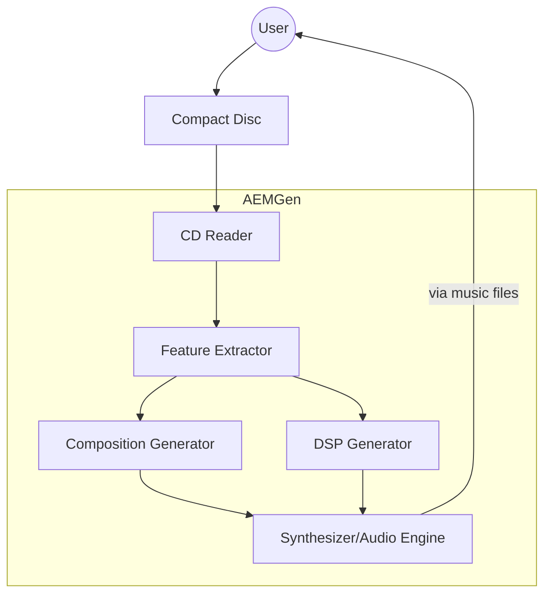

# AEMGen

## Contents

1. [AEMGen](#aemgen)
   1. [Contents](#contents)
   2. [Goals](#goals)
   3. [Influnces](#influnces)
   4. [Constraints](#constraints)
   5. [Challenges](#challenges)
   6. [Current Plan](#current-plan)
   7. [Timeline](#timeline)

## Goals

This project intends to create a hardware device that can generate music based
on an input audio file, and predetermined compostion and DSP rules.

In headlines, the project aims are:

- Determine robust musical rules for "IDM" styled tracks
- Build software that can generate music based on these rules, combined with an
  input audio file
- build/configure a hardware box that allows a user to semi-autonomously
  (ideally autonomously) generate music

The overall aim is to produce a hardware device that can generate music in the
style of "IDM" (Intelligent Dance Music). The device will take an audio CD as
input, analyse the audio to extract features, and then use these features to
generate new music based on a set of predefined rules. The generated music will
be output via a built-in synthesizer/audio engine. Whilst this could be achieved
reasonably trivially using "off the shelf" software and hardware, there is an
aesthetic consideration. The resulting music should sound "right". My intention
is to research the genre, and build a robust corpus of music that can be
analysed to determine the key features of the genre.  
Building the corpus, and ensuring it has a sound philosophical and
methodological grounding will, I believe, be key to its success. Aesthetics will
also play a role in the physical design, including user interface.

## Influnces

The project is influenced by a number of sources, including:

- Artists such as Aphex Twin, Autechre, Squarepusher, and others. Autechre's use
  of real-time Max/MSP is a particular influence
- The "IDM" genre itself, and the associated aesthetics and philosophies
- The "Generative Music" movement, including Brian Eno's work in this area
- David Cope's writing, in particular
  [Virtual Music](https://direct.mit.edu/books/monograph/3821/Virtual-MusicComputer-Synthesis-of-Musical-Style)
- Curtis Roads'
  [The Computer Music Tutorial](https://mitpress.mit.edu/9780262044912/the-computer-music-tutorial/),
  and [Microsound](https://mitpress.mit.edu/9780262681544/microsound/)
- (Indirectly) the work of John Cage, and others in the "chance music" movement
- 90's Software/Hardware aesthetics such as AKAI's S3000 samplers, and early
  DAWs such as Cubase and Pro Tools

## Constraints

My vision for this project will be to create a single style of music "IDM"
(Intelligent Dance Music). There are multiple reasons for this. Primarily it is
a genre that I like, and have listened to for decades. Second, as a primarily
electronic style, it naturally fits with a software/hardware based approach.
Third, whilst IDM is a single term, the styles associated with it are diverse,
so there are is scope to create a wide variety of output.

A key design constraint of the project is that the generative elements must be
computational; predefined rules and algorithms rather than AI models or Machine
Learning. Generative AI may be a short-cut to achieving the goal, and may indeed
result in a more aesthetically appealing result. This, however is not the goal
of the project. With a burgeoning number of AI tools, and companies like Spotify
investing in music generation this is a clear path to explore. It is however, a
path for others to take. Though this project will use other's work, e.g.,
samples and analysis of others' music, it will do so in a small, isolated way,
using a single track. This is an attempt to tread the tension between using
existing work, and recreating it.

Avoiding Generative AI opens the opportunity for the project to be fully open
source, which is a key goal. This aim may affect the available libraries and
tools that can be used, but I value the transparency of open source, and feel it
will provide a good basis for releasing musical algorithms. Whilst the project's
source will be open, it may use non-open tools, or datasets. This will be
particularly the case for research stages, where I may use proprietary tools or
datasets to develop and analyse the corpus. Wherever applicable, however, I will
seek to use open tools and datasets, releasing any scripts or data I create
under an open license.

## Challenges

Creating "musical" sounding output will be the primary challenge. If I were a
professional programmer with a deep understanding of music theory, this would be
a significant challenge. I am neither, and so this will be a significant
challenge. Starting from a position of ignorance, and learning as I go is,
however, part of the appeal of the project. It may also mean my design choices
are not constrained by pre-existing biases. This ignorance does, however mean
that there are many unknown unknowns, and so the project may take a different
path as I learn more. Rather than paralysing the project with analysis, I intend
to adopt an iterative approach; building as I go, and refining or redesigning as
my knowledge deepens. Though this approach will likely mean the project takes
longer to deliver acceptable results, it offers a route where I can apply
learning in a practical way, whilst maintaining some form of direction and
momentum.

## Current Plan

- [ ] **1. Build and release a corpus of IDM Tracks**
  - [x] Source: Lastfm
  - [ ] Source: Musicbrainz
    - [ ] Fetch artists, releases and tracklists
    - [ ] ID IDM tracks that appear on compilations; use this as a popularity
          metric
  - [ ] Source: Discogs
    - [ ] Fetch artists, releases and tracklists
    - [ ] ID IDM tracks that appear on compilations; use this as a popularity
          metric
  - [ ] Secondary Source: hyperreal mailing list
  - [ ] Secondary Source: WATMM forums
  - [ ] Secondary Source: Spotify
  - [ ] Secondary Source: Other ("best lists")
    - [ ] Identify and collect relevant lists
  - [ ] Calculate popularity metrics
  - [ ] merge datasets
  - [ ] clean/filter data
  - [ ] produce full corpus
  - [ ] produce "essentials" corpus (e.g., tracks/releases with popularity
        metrics > _n_)
  - [ ] release corpus / seek feedback / revise as appropriate
  - [ ] document process, and findings
  - [ ] create script guidance (e.g., how to create your own Corpus)
  - [ ] Release Scripts
- [ ] **2. Analyse Corpus** (perhaps just essentials given potential scale)
  - [ ] source music files
  - [ ] extract features (e.g., tempo, key, timbre)
  - [ ] source library (ML?) that can aid with this analysis
  - [ ] Link analysis to existing research (e.g., Virtual Music, Wolfram
        Tones...)
  - [ ] Write up
- [ ] **Build Generative rules**
  - [ ] Define rule sets based on analysis
  - [ ] Implement rules in software
  - [ ] Test and refine rules
- [ ] **3. Build Generative System (Software)**
  - [ ] Define system architecture
    - [ ] Configure nix
    - [ ] Configure services/Applications
    - [ ] Configure hardware
    - [ ] Build software components
      - [ ] Implement audio processing pipeline
      - [ ] Implement feature extraction
      - [ ] Implement generative model
    - [ ] Design user interface
      - [ ] Create wireframes/mockups
      - [ ] Determine library/framework (e.g., Python TUI)
    - [ ] Configure user interface
  - [ ] Implement core functionality
  - [ ] Test and refine system
- [ ] **4. Build Hardware, and Configure Software**
  - [ ] Source hardware
    - [ ] Identify suitable hardware components
      - [ ] understand constraints (e.g., ram, cpu, hard drive)
      - [ ] research minimal display requirements
  - [ ] Acquire hardware
  - [ ] Assemble hardware
  - [ ] Install Operating system
  - [ ] Configure system settings
  - [ ] Test hardware
  - [ ] validate software installation
  - [ ] Document hardware setup

## Timeline

As the project matures, I will add more detail to the timeline. At present, the
timeline is a rough estimate of when I hope to complete each stage.

| task                                   | Start   | End     | MoSCoW | Notes                                        |
| -------------------------------------- | ------- | ------- | ------ | -------------------------------------------- |
| Build Corpus                           | 2025-09 | 2025-11 | Must   | Requires grounding in aesthetics literature  |
| Analyse Corpus                         | 2025-12 | 2026-03 | Must   | Depends on corpus being available            |
| Build Generative Rules                 | 2026-03 | 2026-05 | Must   | Depends on analysis being available          |
| Build Generative System (Software)     | 2026-05 | 2026-08 | Must   | Can start in parallel with rule building     |
| Build Hardware, and Configure Software | 2026-08 | 2026-10 | Must   | Can start in parallel with software building |
